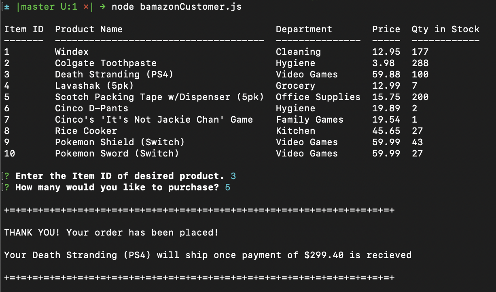
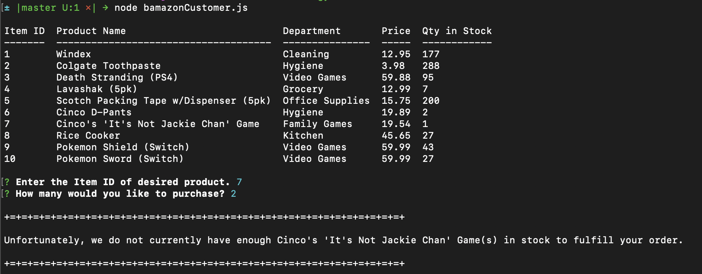

# bamazon

- - -

## What is it?
Bamazon is CLI oriented application that emulates transactions between client and server. 

- - -

1. The application displays a list of avaiable products from the inventory data
2. bamazon will then prompt the user to:
    1. select an item id
    2. specify quantity
3. The order is processed based on database inventory stock:

    **In-Stock**: The image below shows a successful transaction.

        

    **Out-of-Stock**: This image shows output when user selection is out of stock.

        

- - -

## Technology utilized in app
*JavaScript
*Nodejs
*SQL
*Docker

